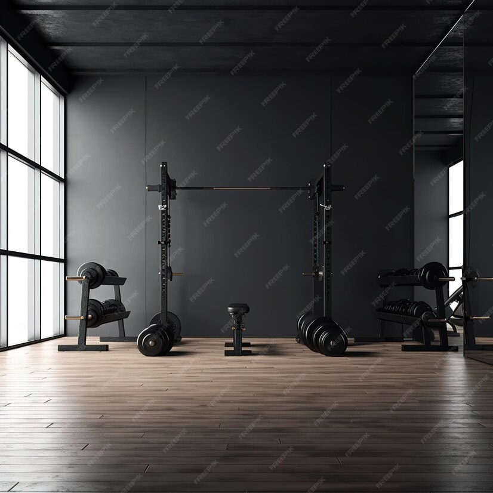

<h1 align="center">🏋️‍♂️ - Academia Gyminimal</h1>

 

  

<h2>😎 Projeto </h2>

- Este projeto (site) foi feito para praticar alguns conceitos de HTML, como forms, listas ordenadas, hierarquia de título além de treinar alguns sobre CSS. 

<h2>💻 Tecnologias </h2>

As tecnologias que foram utilizadas são as seguintes: 

- IDE - <a href="https://code.visualstudio.com/">Visual Studio Code</a>
- HTML - <a href="https://developer.mozilla.org/pt-BR/docs/Web/HTML">HTML</a>
- CSS - <a href="https://developer.mozilla.org/pt-BR/docs/Web/CSS">CSS</a>
